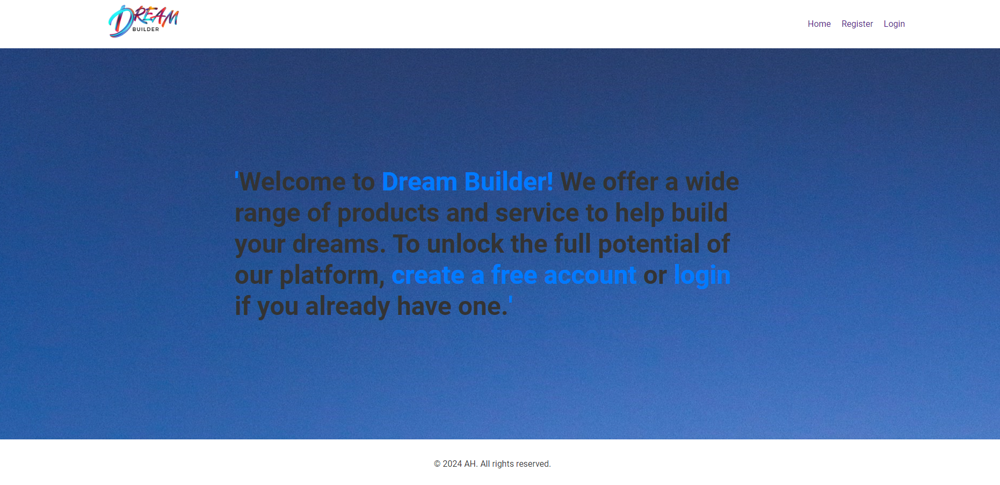
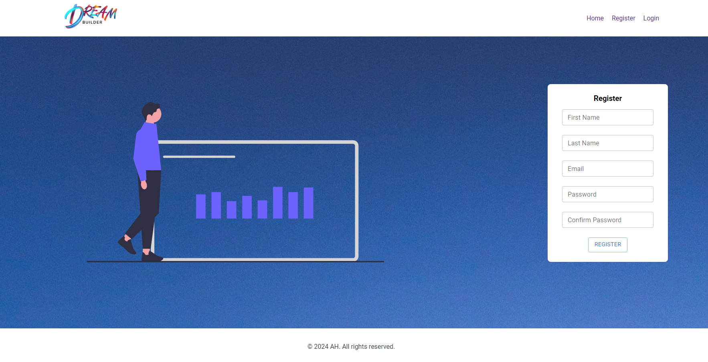
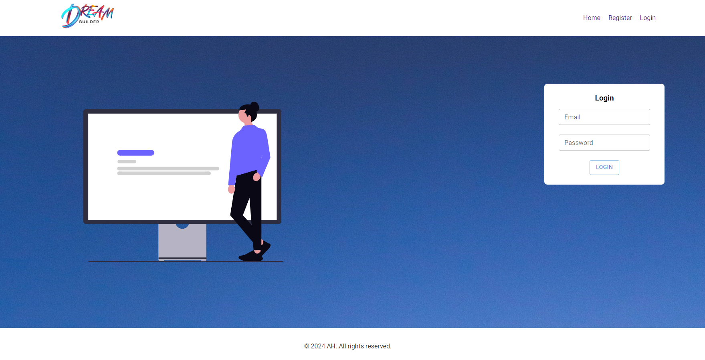
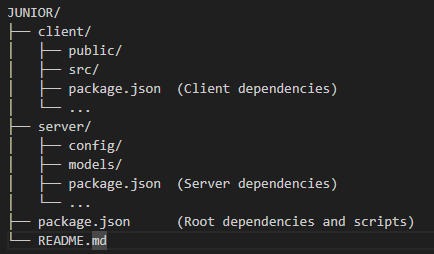

# Project Name
junior full-stack Node.js developer test
## Description

This project is a junior full-stack Node.js developer test . It aims to showcase my skills and knowledge in developing web applications using Node.js, React, MUI, JSON WEB TOKENS (for authorization ) and MongoDB

# Preview
### Homepage 

### Register page

### Login page

### Landing page

## Project Structure

This project uses a monorepo structure with separate package.json files for the root, client, and server:

### Root Package.json
The root `package.json` file contains:
- Scripts to run both client and server
- Any dependencies shared between client and server
- Development dependencies for the overall project

### Client Package.json
Located in the `client/` directory, this file contains:
- Dependencies specific to the front-end application
- Scripts for running and building the client-side code

### Server Package.json
Located in the `server/` directory, this file contains:
- Dependencies specific to the back-end server
- Scripts for running and managing the server

## Getting Started

Instructions on how to set up and run your project...

## Installation

To run this project locally, follow these steps:

1. Clone the repository.
2. Navigate to the project directory.
3. In the root of the project install dependencies using `npm install`
4. Then `cd client` and again install dependencies using `npm install`
5. You can now run the `npm start` command, this will give you access to the front end on your local network.
6. Once the application is running, you can access it by opening your web browser and navigating to `http://localhost:3000`.
7. In a separate terminal `cd server` and install dependencies using `npm install`
8. You can now run `nodemon server.js` command, this will run a instance of an express server.
9. Once the server is running, you can make request to it by using the following address `http://localhost:3001`.

# Api documentation

**API Endpoints:**

* **Base URL:** http://localhost:3000

**Authentication:**

* JWT tokens are used for authentication.
* A secret key (`JWT_SECRET`) is used for signing and verifying tokens (**store this securely, not in production code!**).
* Clients should send the JWT token in the Authorization header with the Bearer schema (e.g., `Authorization: Bearer <token>`).

**Endpoints:**

* **Register User (POST /api/users/register)**
    * Request Body:
        * `firstName` (String): User's first name (required)
        * `lastName` (String): User's last name (required)
        * `email` (String): User's email (required)
        * `password` (String): User's password (required)
    * Response:
        * Status Code:
            * 201 Created: User registered successfully.
            * 400 Bad Request:
                * User with the provided email already exists.
        * Response Body:
            * `message` (String): A message indicating the outcome of the registration.
            * In case of error (`status=400`):
                 `error` (String): An error message describing the issue (e.g., "User already exists").
* **Login User (POST /api/users/login)**
    * Request Body:
        * `email` (String): User's email (required)
        * `password` (String): User's password (required)
    * Response:
        * Status Code:
            * 200 OK: Login successful.
            * 400 Bad Request:
                 Invalid email or password.
        * Response Body:
            * `message` (String): A message indicating the outcome of the login.
            * On success (`status=200`):
                 `token` (String): A JWT token for subsequent authorized requests.
            * In case of error (`status=400`):
                 `message` (String): An error message describing the issue (e.g., "Invalid email or password").
* **Get User Profile (GET /api/users/profile)**
    * Requires a valid JWT token for authorization (place in Authorization header).
    * Response:
        * Status Code:
            * 200 OK: User profile retrieved successfully.
            * 401 Unauthorized: Invalid or missing JWT token.
            * 404 Not Found: User not found for the provided email.
        * Response Body:
            * `message` (String): A message indicating the outcome of the request.
            * On success (`status=200`):
                * `email` (String): User's email address.
                * `firstName` (String): User's first name.
                * `lastName` (String): User's last name.
            * In case of error:`error` (String): An error message describing the issue.

